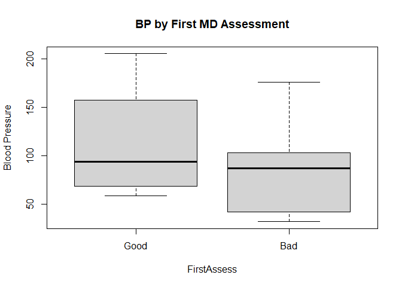
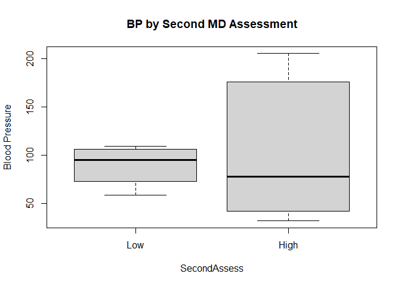
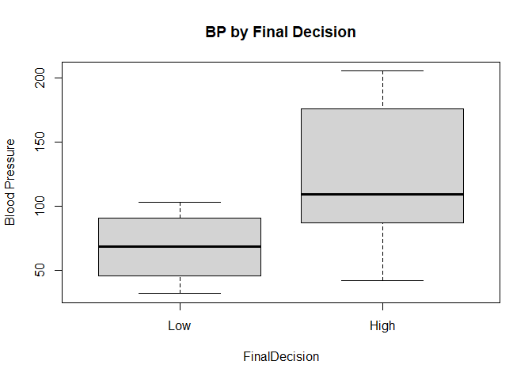
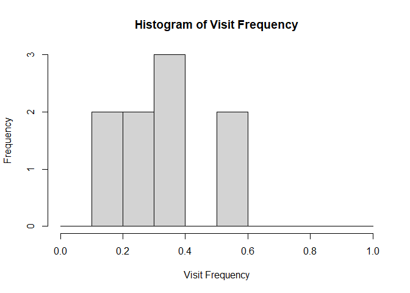
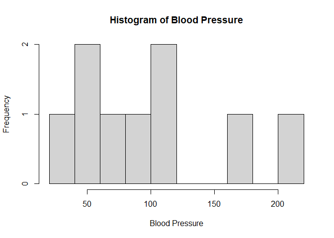

Assignment 4 Plots
================

``` r
boxplot(
  BloodPressure ~ FirstAssess,
  data = df_hosp,
  names = c("Good","Bad"),
  ylab = "Blood Pressure",
  main = "BP by First MD Assessment"
)
```

<!-- -->

``` r
boxplot(
  BloodPressure ~ SecondAssess,
  data = df_hosp,
  names = c("Low","High"),
  ylab = "Blood Pressure",
  main = "BP by Second MD Assessment"
)
```

<!-- -->

``` r
boxplot(
  BloodPressure ~ FinalDecision,
  data = df_hosp,
  names = c("Low","High"),
  ylab = "Blood Pressure",
  main = "BP by Final Decision"
)
```

<!-- -->

``` r
hist(
  df_hosp$Frequency,
  breaks = seq(0, 1, by = .1),
  xlab = "Visit Frequency",
  main = "Histogram of Visit Frequency"
)
```

<!-- -->

``` r
hist(
  df_hosp$BloodPressure,
  breaks = 8,
  xlab = "Blood Pressure",
  main = "Histogram of Blood Pressure"
)
```

<!-- -->
